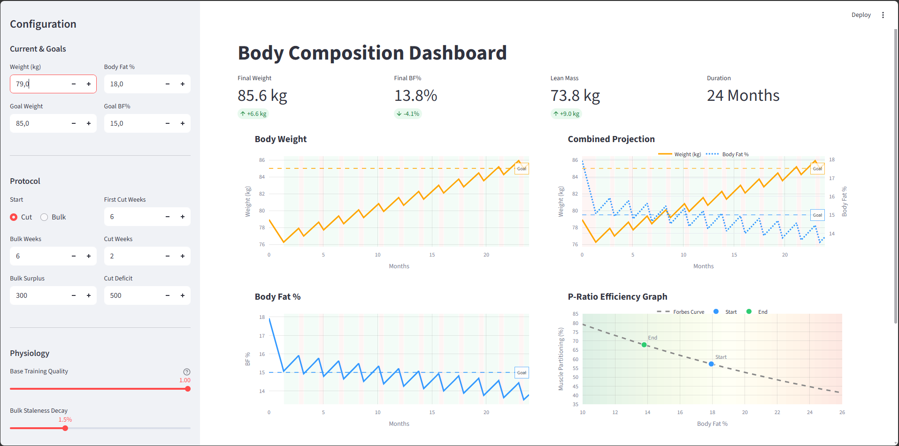

# Body Composition Simulator 📊


A scientific dashboard using physiological models to simulate realistic long-term muscle gain and fat loss trajectories across bulk/cut cycles.



---

## 🚀 Key Features

### 🧬 Physiological Modeling

* **Forbes Law Integration:** Dynamically calculates the "P-Ratio" (partitioning ratio) based on current fat mass, modeling that anabolic efficiency is higher at lower body fat levels.
* **Alpert Limit (Muscle Sparing):** Enforces a biological limit on fat loss (~69 kcal/kg of fat mass/day). Simulations warn and model muscle catabolism if the calorie deficit exceeds this limit.
* **Metabolic Staleness:** Models the decay of anabolic efficiency the longer an individual remains in a caloric surplus, promoting strategic cycle length planning.

### 🛠 Advanced Protocol Planning

* **Geometric Cycle Scaling:** Future bulk/cut cycles can be automatically scaled to model the increasing difficulty of physiological gains over time.
* **Custom Priming Phases:** Define an initial "Mini-Cut" or "Kickstart Bulk" phase before the recurring cycle begins.
* **Interactive Visualizations:**
    * **Combined Projection Chart:** Dual-axis plot tracking Body Weight and Body Fat percentage against set goals.
    * **P-Ratio Efficiency Graph:** Visualizes current Body Fat % on the theoretical Forbes Curve.
    * **Tissue Composition Chart:** Separately tracks Lean Mass and Fat Mass trajectories.

---

## 📦 Installation

1.  **Clone the repository**
    ```bash
    git clone [https://github.com/Znypr/BodyCompSimulator.git](https://github.com/Znypr/BodyCompSimulator.git)
    cd BodyCompSimulator
    ```

2.  **Install dependencies**

    *Ensure you have a `requirements.txt` file generated (e.g., using `pip freeze > requirements.txt`).*
    ```bash
    pip install -r requirements.txt
    ```

3.  **Run the application**
    ```bash
    streamlit run main.py
    ```

---

## 🧠 The Science Behind It

### 1. Forbes Law (Partitioning Ratio)
The partitioning of energy towards lean mass gain in a surplus is modeled using the formula derived from Forbes' research:
> *Formula:* $\text{Lean Gain Ratio} = 10.4 / (10.4 + \text{Fat Mass})$

### 2. The Alpert Limit (Muscle Sparing)
The safe maximum caloric deficit is constrained by the body's ability to mobilize fat stores, estimated at approximately **69 kcal per kilogram of fat mass per day**. Exceeding this limit results in accelerated lean mass loss.

---

## 🎨 Tech Stack
* **Frontend:** [Streamlit](https://streamlit.io/) for the interactive UI.
* **Visualization:** [Plotly Graph Objects](https://plotly.com/python/) for interactive charts.
* **Logic:** [NumPy](https://numpy.org/) & [Pandas](https://pandas.pydata.org/) & [SciPy](https://scipy.org/) (for non-linear equation solving).

## 📄 License
This project is open-source and available under the [MIT License](LICENSE).